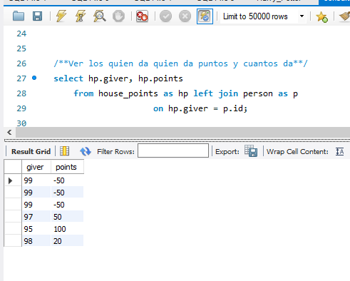
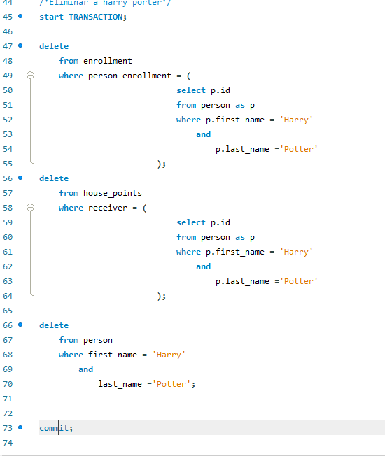

#Consultas JPQL y SQL

---

1. Consulta parametrizada con JPQL que permita encontrar todos los personajes que han sido alumnos de un maestro facilitado por parámetro:
 

3.1 Consulta parametrizada con SQL que tiene como característica principal el uso de inner join uniendo las tablas "house" y " person" con la condición de que el valor de la columna "id" de "person" sea igual al de la columna "head_teacher" de "house"

3.2 Consulta parametrizada con SQL que tiene como característica principal el uso de left join uniendo las tablas "house_points" y "person" con la condición de que el valor de la columna "id" de "person" sea igual al de la columna "giver" de "house_points"

3.3 Consulta parametrizada con SQL en la que mediante el uso de una subconsulta obtenemos el nombre de la tabla "course" buscando por un nombre completo (first and last name)

Extra.1 Transacción en SQL que permite eliminar un alumno teniendo en cuenta sus relaciones.

Ejercicio realizado por Alberto Álvarez, Atenea Portela y Raúl Núñez
